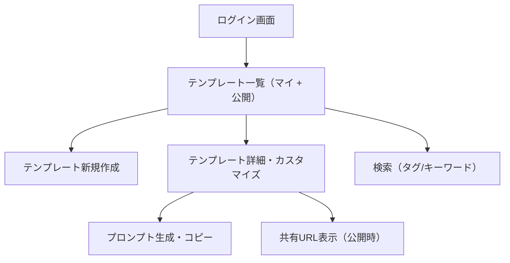

# ユーザー利用シナリオ：生成AI用プロンプト作成アプリ

## 🎯 目的

- 高品質なプロンプトを短時間で生成できるようにする
- ユーザーが自分用／共有用にテンプレートを保存・再利用できる
- 類似プロンプトの整理・発見を支援する

---

## 👤 ペルソナ

- 名前：佐藤 翔（さとう しょう）
- 職業：ライター／マーケター
- スキル：非エンジニア、ChatGPTを頻繁に使う
- 課題：
  - 同じようなプロンプトが増えすぎて整理が大変
  - タスクごとにフォーマットを再利用したい
  - 他人のプロンプトを参考にしたい

---

## 📘 利用シナリオ（代表的な流れ）

### 1. 自分用テンプレートを作る

1. Googleアカウントでログイン
2. テンプレートを新規作成
3. 入力項目（selectやtext）を定義
4. `{{変数名}}` を含むプロンプト本文を入力
5. タグを追加（例：議事録, ブログ, 要約）
6. 保存 → マイテンプレート一覧に表示

### 2. プロンプトを生成・利用する

1. マイテンプレートから1件を選択
2. カスタマイズ項目を選択・入力
3. 即時に生成されるプロンプトを確認
4. コピーしてChatGPTなどに貼り付けて使用

### 3. テンプレートを共有する

1. 作成済テンプレートの「公開」トグルをONにする
2. `/p/:template_id` のURLが生成される
3. 他人がそのURLにアクセスすれば未ログインでも利用可能
4. 他人がそのテンプレートを複製して、自分用テンプレートにもできる

### 4. 他人のテンプレートを検索・再利用する

1. トップページで公開テンプレートの一覧が見られる
2. キーワードやタグで検索・絞り込み
3. 気に入ったテンプレートをカスタマイズして利用（ログイン不要）
4. ログイン済みなら「複製して自分用に保存」も可能

---

## 🧭 画面遷移図（Mermaid）

---

## ✅ ユースケース一覧

| アクター | 行動 | システムの応答 |
|----------|------|----------------|
| ユーザー | Googleでログイン | マイテンプレート一覧を表示 |
| ユーザー | テンプレートを作成・編集 | 保存、一覧に反映 |
| ユーザー | テンプレートを公開 | 共有用URLが生成される |
| 未ログインユーザー | 公開テンプレートを閲覧 | カスタマイズとコピーが可能 |
| ユーザー | タグやキーワードで検索 | 条件に合致するテンプレートを一覧表示 |
| ユーザー | 他人のテンプレートを複製 | 自分用テンプレートとして保存可能 |

---

## 🧩 検討中・拡張予定の機能（備忘）

- テンプレートの「複製」機能（fork）
- お気に入り・評価機能（スター or いいね）
- ユーザーごとのテンプレート統計
- タグの人気ランキング

## アーキテクチャ

- ホスティング：Netlify
- DB：Supabase
- バックエンド：なし
	- さしあたりはNetlify Functionsを利用してバックエンドを使わない
	- ただし公式に公開する決定をしたときはバックエンドとしてSupabase Edge Functions（Deno）を利用できるような設計にしておく
- ログイン：OAuth (Googleログイン)
